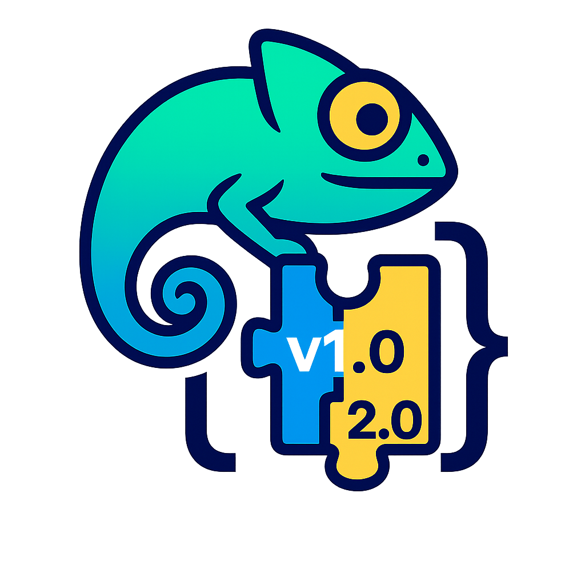

<p align="center">
  
</p>

# GitChameleon


This is an evaluation harness for the GitChameleon dataset.

[](https://github.com/mrcabbage972/GitChameleonBenchmark/actions/workflows/ci.yaml)

## 🚀 Usage
### 📦 Prerequisites
Before you begin, ensure you have the following installed:
1. [Python 3.9+](https://www.python.org/downloads/)
1. [Poetry](https://python-poetry.org/docs/)
1. [Docker[(https://docs.docker.com/get-started/get-docker/)

### 🏗️ Harness Setup
1. Clone the repository:
```
git clone https://github.com/mrcabbage972/GitChameleonBenchmark.git
```
2. Run the setup command:
```
make evals-setup
```

### ▶️ Running Evaluation
To evaluate your solution, execute the following command:
```
make run-eval SOLUTION_PATH=[the absolute path to the solution file]
```

The success rates will be printed out and detailed logs will be written to an output file next to the solution file.

## 🐞 Reporting Issues

If you run into any bugs or have trouble using **GitChameleon**, please open an issue on GitHub so we can help:

[](https://github.com/mrcabbage972/GitChameleonBenchmark/issues)

Before opening a new issue, please search the existing issues to see if someone else has already reported your problem. When you do file an issue, include:

1. **What you expected to happen**  
2. **What actually happened** (error messages, stack traces, screenshots)  
3. **Steps to reproduce** (a minimal code example or command)  
4. **Your environment** (OS, Python version, GitChameleon commit hash)

That extra detail helps us diagnose and fix things much faster.


## 📚 Citation
TBD
