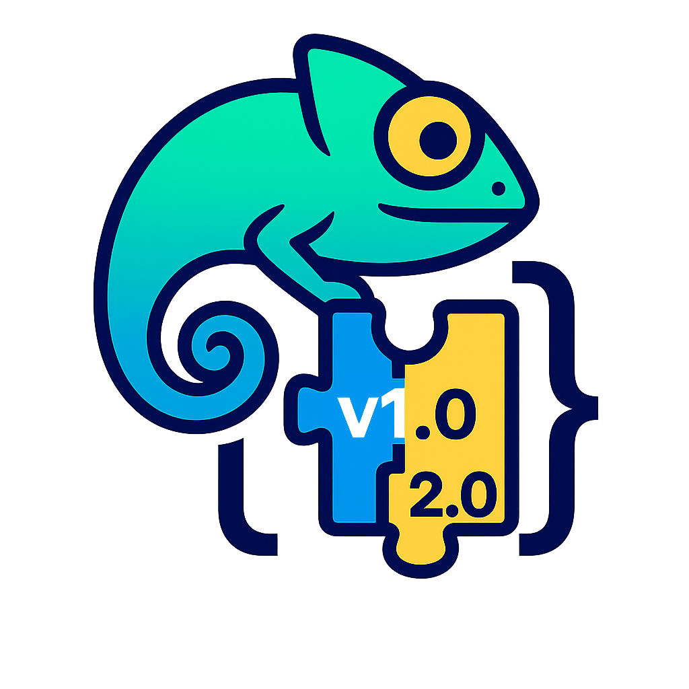

<p align="center">
  
</p>

# GitChameleon 2.0 [ACL 2026, Main]


This is an evaluation harness for **GitChameleon 2.0**, an AI coding benchmark that comprises 328 Python-based problems tha are conditioned on specific versions of popular libraries for scientific computing and web development.

[](https://gitchameleon-2-0.github.io)
[](https://github.com/mrcabbage972/GitChameleonBenchmark/actions/workflows/ci.yaml)

[](https://huggingface.co/datasets/cabbage972/GitChameleon-2.0)

> **Project website:** [gitchameleon-2-0.github.io](https://gitchameleon-2-0.github.io) — paper, results, dataset, and citation guidance.

## 📂 Dataset

The dataset is hosted on Hugging Face at [cabbage972/GitChameleon-2.0](https://huggingface.co/datasets/cabbage972/GitChameleon-2.0).

```python
from datasets import load_dataset

ds = load_dataset("cabbage972/GitChameleon-2.0", "problems")
```

## 🚀 Usage
### 📦 Prerequisites
Before you begin, ensure you have the following installed:
1. [Python 3.9+](https://www.python.org/downloads/)
1. [Poetry](https://python-poetry.org/docs/)
1. [Docker](https://docs.docker.com/get-started/get-docker/)

### 🏗️ Harness Setup
1. Clone the repository:
```
git clone https://github.com/mrcabbage972/GitChameleonBenchmark.git
```
2. Run the setup command:
```
make evals-setup
```

### ▶️ Running Evaluation
To evaluate your solution, execute the following command:
```
evaluate --solution-path SOLUTION_PATH [--workers WORKERS] 
```

The success rates will be printed out and detailed logs will be written to an output file next to the solution file.

### 🖥️ Running on HPC clusters (Apptainer)

Shared clusters generally do not allow Docker, but provide [Apptainer](https://apptainer.org/)
(formerly Singularity). The harness supports it as an alternative runtime — `evaluate` picks it
automatically when no Docker daemon is reachable, or you can select it with `--runtime apptainer`.

```bash
make apptainer-build                          # convert the published image into containers/gitchameleon.sif
make apptainer-venvs                          # build the dataset venvs (needs access to PyPI)
make run-eval-apptainer SOLUTION_PATH=/abs/path/to/solutions.jsonl
```

The image is read-only under Apptainer, which runs it as the invoking user rather than as root.
The harness therefore sets `PYENV_VERSION` instead of running `pyenv global` (which would write to
`$PYENV_ROOT`), and pins `HOME=/root` so poetry finds the venv baked into the image.

#### On a SLURM cluster

The dataset needs 99 virtual environments — roughly a million small files, enough to exhaust the
*file-count* quota of a typical cluster `home` or `scratch` filesystem. The job templates in
`scripts/slurm/` therefore build them on the compute node's local disk and keep them on the shared
filesystem as a single compressed archive, which each evaluation job unpacks back onto local disk:

```bash
sbatch --account=<alloc> scripts/slurm/build_venvs.sbatch          # ~1 h, writes $SCRATCH/gitchameleon/venvs.tar.zst
sbatch --account=<alloc> --export=ALL,SOLUTION=/abs/path/sol.jsonl \
       scripts/slurm/run_eval.sbatch
```

Building the venvs needs to reach PyPI, and on most clusters compute nodes have no direct outbound
route; `build_venvs.sbatch` loads the `httpproxy` module where one is available. Evaluation itself
needs no network. The archive is self-contained, so it can also be copied to another cluster
instead of being rebuilt there.

> Note on overlays: mounting the venvs from an ext3 or squashfs `--overlay` image would be the
> tidier option, but Apptainer can only mount those when installed setuid, which shared clusters
> generally avoid. The archive approach needs no such privileges.

## 🐞 Reporting Issues

If you run into any bugs or have trouble using **GitChameleon**, please open an issue on GitHub so we can help:

[](https://github.com/mrcabbage972/GitChameleonBenchmark/issues)

Before opening a new issue, please search the existing issues to see if someone else has already reported your problem. When you do file an issue, include:

1. **What you expected to happen**  
2. **What actually happened** (error messages, stack traces, screenshots)  
3. **Steps to reproduce** (a minimal code example or command)  
4. **Your environment** (OS, Python version, GitChameleon commit hash)

That extra detail helps us diagnose and fix things much faster.


## 📚 Citation
```
@misc{misra2025gitchameleon20evaluatingai,
      title={GitChameleon 2.0: Evaluating AI Code Generation Against Python Library Version Incompatibilities}, 
      author={Diganta Misra and Nizar Islah and Victor May and Brice Rauby and Zihan Wang and Justine Gehring and Antonio Orvieto and Muawiz Chaudhary and Eilif B. Muller and Irina Rish and Samira Ebrahimi Kahou and Massimo Caccia},
      year={2025},
      eprint={2507.12367},
      archivePrefix={arXiv},
      primaryClass={cs.SE},
      url={https://arxiv.org/abs/2507.12367}, 
}
```
